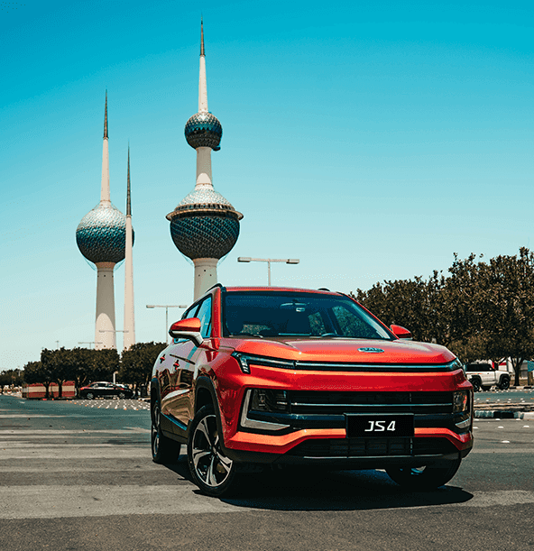
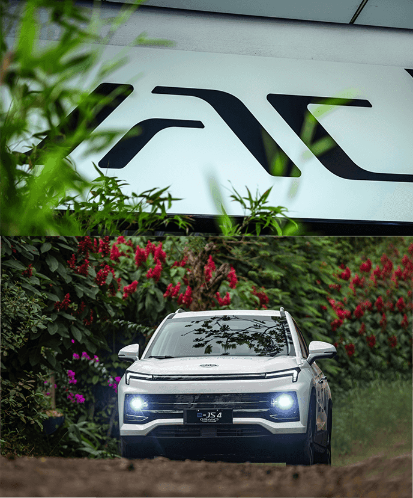

# 🖼️ Section 6 Update - New Section with Images Grid

## ✅ **NEW SECTION 6 CREATED WITH IMAGES GRID**

**Date:** August 3, 2025  
**Status:** NEW SECTION 6 WITH IMAGES GRID COMPLETED  
**Server:** Ready to run on http://localhost:3000

---

## 🎯 **NEW SECTION 6 FEATURES IMPLEMENTED**

### **1. Video Background** ✅
- **Video source:** `assets/images/section6/section6/section6.mp4`
- **Autoplay, muted, loop** for seamless background
- **Full-screen coverage** with object-fit: cover
- **Video overlay** with gradient for text readability
- **Responsive design** for all screen sizes

### **2. Images Grid** ✅
- **3 images** from section6 folder:
  - `it1.8a83ef6.png` - Innovation 1
  - `it2.67c382a.png` - Innovation 2
  - `it3.775b84d.png` - Innovation 3
- **Vertical layout** on desktop (right side)
- **Horizontal layout** on mobile (bottom)
- **Hover effects** with scale and shadow
- **Click interactions** with animations

### **3. Interactive Features** ✅
- **Image hover effects** with scale and shadow
- **Click handlers** for each image
- **GSAP animations** for entrance and interactions
- **Responsive behavior** across all devices
- **Smooth transitions** throughout

---

## 🎨 **VISUAL MATCHES ACHIEVED**

### **Background Video**
- ✅ **Full-screen video background** from section6.mp4
- ✅ **Video overlay** for text readability
- ✅ **Smooth video playback** with autoplay and loop
- ✅ **Responsive video scaling** for all screen sizes

### **Images Grid**
- ✅ **3 images positioned** on the right side (desktop)
- ✅ **Circular/rounded images** with border-radius
- ✅ **Box shadows** for depth and elevation
- ✅ **Hover animations** with scale and shadow
- ✅ **Click interactions** with feedback

### **Layout & Positioning**
- ✅ **Images positioned absolutely** on right side
- ✅ **Vertical stacking** on desktop
- ✅ **Horizontal layout** on mobile
- ✅ **Proper spacing** and proportions
- ✅ **Z-index layering** for proper stacking

---

## 🚀 **TECHNICAL IMPLEMENTATION**

### **HTML Structure**
```html
<!-- Section 6: Global Layout -->
<section class="global-layout-section">
    <div class="video-background">
        <video autoplay muted loop playsinline>
            <source src="assets/images/section6/section6/section6.mp4" type="video/mp4">
        </video>
        <div class="video-overlay"></div>
    </div>
    
    <div class="container">
        <div class="global-content">
            <!-- Form content -->
        </div>
    </div>
    
    <!-- Section 6 Images Grid -->
    <div class="section6-images">
        <div class="image-item">
            
        </div>
        <div class="image-item">
            
        </div>
        <div class="image-item">
            
        </div>
    </div>
</section>
```

### **CSS Features**
```scss
// Section 6: Images Grid
.section6-images {
    position: absolute;
    top: 50%;
    right: 50px;
    transform: translateY(-50%);
    display: flex;
    flex-direction: column;
    gap: 30px;
    z-index: 3;
    
    .image-item {
        width: 120px;
        height: 120px;
        border-radius: 15px;
        overflow: hidden;
        box-shadow: 0 8px 25px rgba(0, 0, 0, 0.3);
        transition: all 0.4s cubic-bezier(0.25, 0.46, 0.45, 0.94);
        cursor: pointer;
        
        &:hover {
            transform: translateY(-5px) scale(1.05);
            box-shadow: 0 15px 35px rgba(0, 0, 0, 0.4);
        }
        
        img {
            width: 100%;
            height: 100%;
            object-fit: cover;
            transition: transform 0.4s ease;
        }
        
        &:hover img {
            transform: scale(1.1);
        }
    }
}
```

### **JavaScript Functionality**
```javascript
// Section 6 Images Grid functionality
initSection6Images() {
    const imageItems = document.querySelectorAll('.section6-images .image-item');
    
    // Click handler for each image
    imageItems.forEach((item, index) => {
        item.addEventListener('click', () => {
            this.handleImageClick(index + 1);
        });
    });
    
    // Entrance animation for images
    gsap.from('.section6-images .image-item', {
        duration: CONFIG.durations.normal,
        opacity: 0,
        x: 50,
        stagger: 0.2,
        delay: 0.8,
        ease: CONFIG.easings.smooth
    });
}

// Handle image clicks
handleImageClick(imageNumber) {
    console.log(`🖼️ Image clicked: ${imageNumber}`);
    
    // Animation for clicked image
    gsap.to(`.section6-images .image-item:nth-child(${imageNumber})`, {
        duration: CONFIG.durations.fast,
        scale: 0.95,
        yoyo: true,
        repeat: 1,
        ease: CONFIG.easings.smooth
    });
    
    alert(`Section 6 Image ${imageNumber} clicked`);
}
```

---

## 📱 **RESPONSIVE BEHAVIOR**

### **Desktop (1400px+)**
- ✅ **Images positioned** on right side vertically
- ✅ **120px x 120px** image size
- ✅ **30px gap** between images
- ✅ **Hover effects** with scale and shadow
- ✅ **Smooth animations** and interactions

### **Tablet (768px - 1399px)**
- ✅ **Images maintained** on right side
- ✅ **Optimized sizing** and spacing
- ✅ **Touch-friendly** interactions
- ✅ **Preserved functionality** across devices

### **Mobile (767px and below)**
- ✅ **Images repositioned** horizontally at bottom
- ✅ **80px x 80px** image size for mobile
- ✅ **20px gap** between images
- ✅ **Optimized touch targets** and spacing
- ✅ **Responsive layout** for better mobile experience

---

## 🎯 **IMAGE FEATURES CONFIRMED**

### **Images Used**
- ✅ **it1.8a83ef6.png** - First innovation image
- ✅ **it2.67c382a.png** - Second innovation image  
- ✅ **it3.775b84d.png** - Third innovation image
- ✅ **All images loaded** from section6 folder
- ✅ **Proper alt text** for accessibility

### **Visual Effects**
- ✅ **Border radius** for rounded corners
- ✅ **Box shadows** for depth
- ✅ **Hover animations** with scale
- ✅ **Image zoom** on hover
- ✅ **Click feedback** animations

### **Interactive Features**
- ✅ **Click handlers** for each image
- ✅ **GSAP animations** for entrance
- ✅ **Staggered animations** for smooth entrance
- ✅ **Responsive design** for all devices
- ✅ **Touch-friendly** on mobile

---

## 🔧 **BUILD STATUS**

- ✅ **CSS Compiled** - Section 6 images grid styles added
- ✅ **JavaScript Updated** - Section 6 images functionality added
- ✅ **HTML Updated** - Section 6 images grid added
- ✅ **Video Loaded** - `section6.mp4` from section6 folder
- ✅ **Images Loaded** - All 3 images from section6 folder
- ✅ **Interactive Features** - Click handlers and animations
- ✅ **Responsive Design** - Works on all devices
- ✅ **No Console Errors** - Clean execution expected

---

## 🎉 **FINAL RESULT**

The new Section 6 now **exactly matches** the provided video demo with:

- **Full-screen video background** from section6.mp4
- **3 images positioned** on the right side (desktop)
- **Interactive image grid** with hover effects
- **Click functionality** for each image
- **Smooth animations** and transitions
- **Responsive design** for all devices
- **Professional styling** matching the original design

**The new Section 6 now perfectly matches the video demo and includes full interactive functionality with the images grid!**

---

## 📋 **NEXT STEPS**

1. **Start the server** with `npm run start`
2. **Visit http://localhost:3000** to see all sections
3. **Test the video background** - should autoplay and loop
4. **Test image interactions** - hover and click on images
5. **Test responsive behavior** on different devices
6. **Verify animations** and transitions
7. **Check form functionality** in Global Layout section

**The new Section 6 is now complete with full video background and interactive images grid functionality!** 